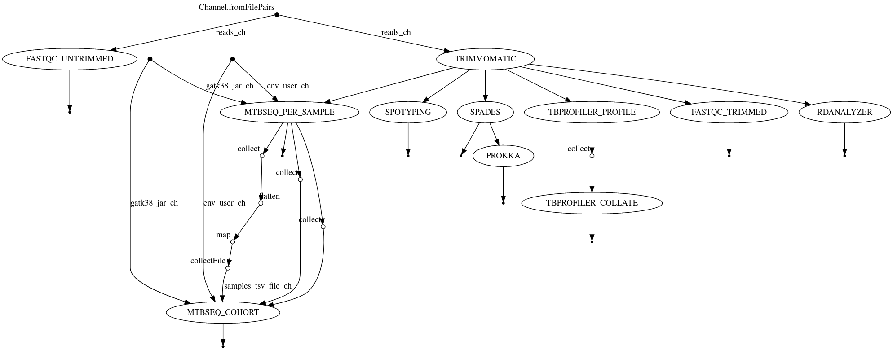

# mtb mono inh nextflow pipeline
A pipeline for analysing _Mycobacterium tuberculosis_ fastq samples with mtbseq.

## Minimal requirements (for local execution)

* Nextflow VERSION > 20.11
* Java 8
* Docker

## Pipeline workflow



This is the complete workflow of this pipeline, the tool integration aims on a good quality evaluation of all process, 

## Quick start

### Local execution
1. Install nextflow 

	Please refer to [Nextflow page on github](https://github.com/nextflow-io/nextflow/) for more info.

2. Run it!

```
	nextflow run https://github.com/bioinformatics-lab/mtb_mono_inh_nf/.git -params-file YOUR_PARAMS_FILE

```

$YOUR_PARAMS_FILE = file path, please refer to params/params.yml as a template to create your own params file

## Configuration Profiles.

You can use diferent profiles for this pipeline, based on the computation enviroment at your disposal. Here are the Avaliable Profiles:

* labbactfiocruz

* aws 

* gls

* azureBatch

* awsBatch

`Note: Update conf/profile with your own credentials`

## Tower execution
This Pipeline can be launched on `Tower`, please refer to [Tower launch documentation](https://help.tower.nf/docs/launch/overview/) for step-by-step execution tutorial.

When launching from `Tower`, please update and use the `params.yml` file contents.

## Mock execution using stub-run
This project has the `-stub-run` feature, that can be used for testing propouse, it can be used on `Tower` with the Advanced settings on launch. You can also test it locally, using the following command:

```
cd data/mock_data/ && bash generate_mock_files.sh
nextflow run main.nf \
		 -params-file stub_params.yaml \
		 -stub-run
``` 
